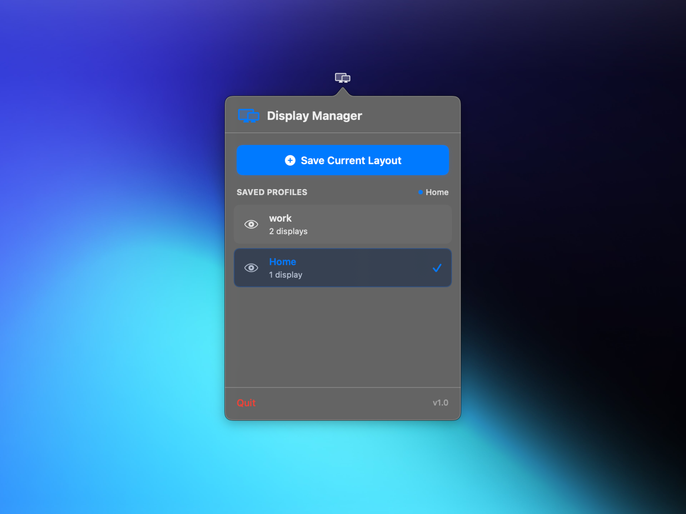

# Display Manager

A macOS menu bar app for saving and switching between display configurations.


## Mockup



## Overview

Display Manager lives in your menu bar and lets you:
- Save your current display arrangement as a named profile
- Switch between configurations with one click
- Preview display layouts before applying
- Delete profiles you no longer need

Useful if you frequently switch between desk setups, presentations, or clamshell mode.

## Features

- **Save Current Layout** – Captures resolution, position, and display type for all connected screens
- **Apply Profiles** – Switches display configuration instantly
- **Visual Preview** – Shows a scaled diagram of each display's position before you apply
- **Applied Indicator** – Highlights the currently active profile
- **Safe Actions** – Prevents overlapping apply/capture operations and validates profile names
- **Menu Bar Only** – No Dock icon, lives quietly in the status bar

## Requirements

- macOS 15.5 or later
- `displayplacer` binary (bundled — no separate install needed)
- Multiple displays (for meaningful use)

## Installation

### Build from Source

1. Clone the repo:
   ```bash
   git clone https://github.com/Divyansh2903/displaymanager.git
   cd displaymanager
   ```

2. Open in Xcode:
   ```bash
   open DisplayManager.xcodeproj
   ```

3. Build and run (`⌘R`) — the `displayplacer` binary is already bundled.

### Pre-built Binary

1. Download from the [Releases](https://github.com/Divyansh2903/displaymanager/releases) page
2. Move to `/Applications`
3. If macOS blocks launch: **System Settings → Privacy & Security → Open Anyway**

## Usage

1. **Click the menu bar icon** (display symbol) to open the panel
2. **Save Current Layout** — name it (e.g. "Work – Dual Monitor") and click Save
3. **Apply** — click the play button next to any saved profile
4. **Preview** — click the eye icon to see the display arrangement
5. **Delete** — click the trash icon and confirm

## Technical Details

- **SwiftUI + AppKit** for UI and menu bar integration
- **CoreGraphics** for display geometry calculations
- **displayplacer** ([jakehilborn/displayplacer](https://github.com/jakehilborn/displayplacer)) does the heavy lifting — detecting and applying display configurations
- Profiles are stored as JSON in `~/Library/Application Support/DisplayManager/`

## Troubleshooting

**"Apple couldn't verify Display Manager is free of malware"**
Go to **System Settings → Privacy & Security → Open Anyway**, or right-click the app and choose Open.

**App doesn't appear in menu bar**
Check Activity Monitor to confirm it's running. Try quitting and relaunching.

**Profile fails to apply**
Ensure all displays in the profile are connected and powered on. If hardware has changed, save a new profile.

**Monitor unplugged after saving a profile**
Display Manager detects missing screens and shows a clear error instead of raw command output. Reconnect the missing monitor(s) or save the current setup as a new profile.

**Displays not detected correctly**
Restart the app after connecting or disconnecting displays.

## License

MIT — see [LICENSE](LICENSE).

## Acknowledgments

Built on top of [displayplacer](https://github.com/jakehilborn/displayplacer) by jakehilborn.
